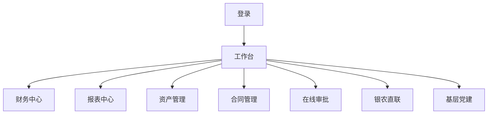
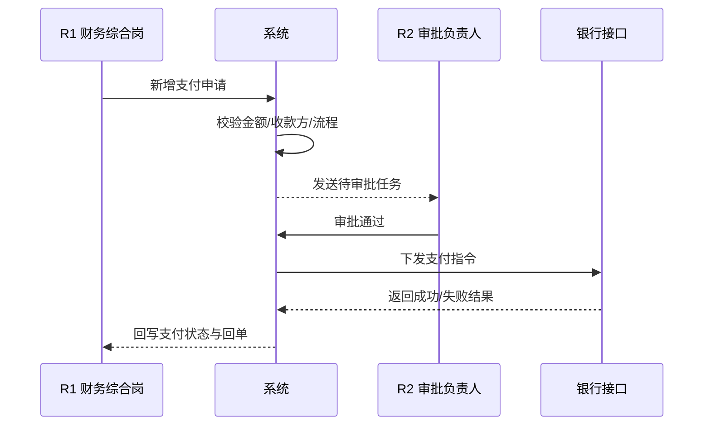

# 村委财务事务管理系统 原型图（v0.1）

## 1. 页面树

## 2. 关键流程：支付审批 + 银农直联

## 3. 关键流程：日记账到报表

## 4. 页面低保真说明
- 工作台：待办审批、待审凭证、未结账提醒、接口异常提醒
- 财务中心：日记账、凭证、导入导出打印、明细与日志
- 报表中心：资产负债表、收益分配、做账进度、下钻与导出
- 资产管理：卡片、变更、处置、删除校验
- 合同管理：新增、修改、验收、终止、附件
- 在线审批：我的待办、我发起、历史审批轨迹
- 银农直联：接口配置、账户、余额、回单日志
- 基层党建：组织树、党员、关系变更、学习进度

## 5. 原型验收
1. 可演示“申请 -> 审批 -> 银行执行 -> 回单留痕”闭环。
2. 报表可下钻到源凭证。
3. 删除操作具备引用校验拦截。
4. 列表页具备查询、导出、打印。
