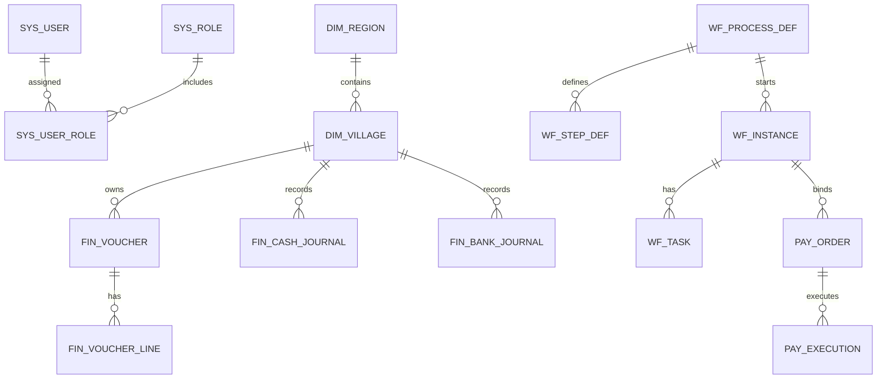

# 村委财务事务管理系统 数据结构设计（v0.1）

## 1. 模块目标
本模块是村级财务业务执行底座，覆盖“收支登记 -> 凭证处理 -> 审批支付 -> 银行执行 -> 报表固化 -> 监管抽查”全链路。

## 2. 合并角色
- R1 财务综合岗（出纳+会计+资产+合同+支付经办）
- R2 审批负责人（村主任/书记/财务负责人）
- R3 银农直联岗（接口/账户/对账/回单）
- R4 监管复核岗
- R5 党建管理岗
- R6 系统管理员

## 3. 核心数据域
| 数据域 | 关键表 | 说明 |
|---|---|---|
| 组织权限 | `sys_user`, `sys_role`, `sys_user_role`, `dim_region`, `dim_village` | 用户、角色、区划、村集体主体 |
| 财务中心 | `fin_voucher`, `fin_voucher_line`, `fin_cash_journal`, `fin_bank_journal`, `fin_period_close` | 凭证、日记账、结账 |
| 在线审批 | `wf_process_def`, `wf_step_def`, `wf_instance`, `wf_task`, `pay_order`, `pay_execution` | 流程定义、审批任务、支付执行 |
| 报表中心 | `rpt_balance_sheet`, `rpt_income_distribution`, `rpt_bookkeeping_progress` | 监管口径报表快照 |
| 资产管理 | `ast_asset_card`, `ast_asset_change_log`, `ast_asset_disposal` | 资产全生命周期 |
| 合同管理 | `ctr_contract`, `ctr_contract_attachment`, `ctr_acceptance`, `ctr_termination` | 合同台账、验收、终止 |
| 银农直联 | `bank_endpoint_config`, `bank_account`, `bank_counterparty_org`, `bank_counterparty_person`, `bank_receipt_download_log` | 银行接口与对账追踪 |
| 基层党建 | `party_org`, `party_member`, `party_relation_change`, `party_learning_course`, `party_learning_progress` | 组织、党员、学习闭环 |
| 审计留痕 | `op_audit_log` | 关键操作全量留痕 |

## 4. ER 图

## 5. 状态机
- 凭证：`DRAFT -> SUBMITTED -> APPROVED -> POSTED -> CLOSED`
- 支付单：`DRAFT -> IN_APPROVAL -> APPROVED -> SENT_TO_BANK -> SUCCESS/FAILED -> RECONCILED`
- 合同：`DRAFT -> ACTIVE -> ACCEPTED -> TERMINATED`
- 资产：`IN_USE -> CHANGED -> DISPOSAL_APPLY -> DISPOSED`

## 6. 一致性规则
1. 凭证主从表必须事务提交，借贷平衡。
2. 支付单未通过审批前禁止下发银行。
3. 合同、资产删除均需进行关联引用校验。
4. 报表快照表（`rpt_*`）仅读，不反写业务数据。
