# 村委财务事务管理系统原型图（来源：页面功能字典）

- 数据源：`docs/页面功能字典_村委财务事务管理系统.xlsx`
- 页面总数：32
- 模块数：7

## 模块与页面分布
| 所属模块 | 页面数 |
|---|---:|
| 财务中心 | 16 |
| 报表中心 | 4 |
| 资产管理 | 4 |
| 合同管理 | 3 |
| 在线审批 | 3 |
| 银农直联 | 1 |
| 基层党建 | 1 |

## 原型导航图

```mermaid
flowchart TD
  ROOT["村委财务事务管理系统"]
  ROOT --> M1["财务中心"]
  M1 --> M1P1["P01 财务中心-出纳管理"]
  M1 --> M1P2["P02 财务中心-凭证管理"]
  M1 --> M1P3["P03 财务中心-期末处理"]
  M1 --> M1P4["P04 财务中心-序时账"]
  M1 --> M1P5["P05 财务中心-科目余额表"]
  M1 --> M1P6["P06 财务中心-科目汇总表"]
  M1 --> M1P7["P07 财务中心-明细账"]
  M1 --> M1P8["P08 财务中心-总账"]
  M1 --> M1P9["P09 财务中心-总账日记账"]
  M1 --> M1P10["P10 财务中心-收支明细表"]
  M1 --> M1P11["P11 财务中心-辅助核算余额表"]
  M1 --> M1P12["P12 财务中心-辅助核算明细账"]
  M1 --> M1P13["P13 财务中心-财务收支情况一览表"]
  M1 --> M1P14["P14 财务中心-多栏账"]
  M1 --> M1P15["P15 财务中心-财务日志"]
  M1 --> M1P16["P16 财务中心-基础设置"]
  ROOT --> M2["报表中心"]
  M2 --> M2P1["P17 报表中心-资产负债表"]
  M2 --> M2P2["P18 报表中心-收益及收益分配表"]
  M2 --> M2P3["P19 报表中心-做账进度表"]
  M2 --> M2P4["P20 报表中心-科目汇总统计报表"]
  ROOT --> M3["资产管理"]
  M3 --> M3P1["P21 资产管理-资产列表"]
  M3 --> M3P2["P22 资产管理-资产折旧"]
  M3 --> M3P3["P23 资产管理-资产结账"]
  M3 --> M3P4["P24 资产管理-资产报表"]
  ROOT --> M4["合同管理"]
  M4 --> M4P1["P25 合同管理-合同列表"]
  M4 --> M4P2["P26 合同管理-合同变更"]
  M4 --> M4P3["P27 合同管理-合同收付款报表"]
  ROOT --> M5["在线审批"]
  M5 --> M5P1["P28 在线审批-支付申请"]
  M5 --> M5P2["P29 在线审批-审批中心"]
  M5 --> M5P3["P30 在线审批-流程配置"]
  ROOT --> M6["银农直联"]
  M6 --> M6P1["P31 银农直联-接口与账户管理"]
  ROOT --> M7["基层党建"]
  M7 --> M7P1["P32 基层党建-党建管理"]
```

## 1. 财务中心
| 原型编号 | 页面名称 | 承载对象 | 核心功能清单 | 推荐页面结构 | 备注 |
|---|---|---|---|---|---|
| P01 | 财务中心-出纳管理 | 银行日记账、现金日记账、内部转账、账户汇总 | 查询；新增；修改；删除；导入模板；导入；导出；打印；自动生成凭证；列表展示；账户汇总查询 | 查询区、操作按钮区、数据表格区、导入弹窗、详情弹窗 | 适合单独生成页面原型 |
| P02 | 财务中心-凭证管理 | 记账凭证录入、修改、审核、反审核、导出、附件管理、回收站 | 新增凭证；保存并新增；备注；上传附件；附单据数量；打印设置；打印；审核；反审核；导出；修改；插入；查询；回收站查询；还原；彻底删除 | 查询区、凭证编辑表单、分录表格、附件区、操作按钮区、回收站列表 | 适合拆成列表页+编辑页 |
| P03 | 财务中心-期末处理 | 结转损益、月结、反结账、结转试算 | 选择会计期间；期末处理；结转科目配置；损益凭证类型；结转试算；自定义结转模板；月结；反结账；批量反结账 | 查询区、配置区、处理结果区、操作按钮区、结果列表 | 适合做流程型页面 |
| P04 | 财务中心-序时账 | 按时间顺序展示交易流水并穿透凭证 | 查询；排序；筛选；查看凭证详情；穿透查看；导出；打印 | 查询区、数据表格区、凭证详情弹窗、操作按钮区 | 与明细账风格保持一致 |
| P05 | 财务中心-科目余额表 | 查看科目期初、本期发生、期末余额，并支持对比分析 | 查询期间；按科目级次查询；对比查询；趋势分析；预警设置；导出；打印 | 查询区、表格区、分析区、打印设置区 | 可加简单图表 |
| P06 | 财务中心-科目汇总表 | 按科目汇总借贷发生额 | 查询；筛选；排序；打印；打印详情设置；导出 | 查询区、数据表格区、打印设置弹窗、操作按钮区 | 和报表中心相关统计页字段需一致 |
| P07 | 财务中心-明细账 | 查看每个会计科目的明细交易 | 查询；组合筛选；排序；导出；打印 | 查询区、数据表格区、操作按钮区 | 与总账、总账日记账风格统一 |
| P08 | 财务中心-总账 | 按总分类查看期初、本期、期末余额 | 查询；排序；筛选；导出；打印 | 查询区、数据表格区、操作按钮区 | 可与明细账共用组件 |
| P09 | 财务中心-总账日记账 | 在同一页面查看交易记录与对应科目余额 | 查询；组合筛选；导出；打印 | 查询区、数据表格区、操作按钮区 | 适合作为复合账簿页 |
| P10 | 财务中心-收支明细表 | 查看收入来源、支出项目、金额等明细 | 查询；排序；筛选；导出；打印 | 查询区、数据表格区、操作按钮区 | 适合作为报表风格页面 |
| P11 | 财务中心-辅助核算余额表 | 查看辅助核算项目余额 | 查询；排序；筛选；导出；打印 | 查询区、数据表格区、操作按钮区 | 与辅助核算明细账关联 |
| P12 | 财务中心-辅助核算明细账 | 查看辅助核算项目明细交易 | 查询；排序；筛选；导出；打印 | 查询区、数据表格区、操作按钮区 | 与辅助核算余额表配套 |
| P13 | 财务中心-财务收支情况一览表 | 综合查看收入总额、支出总额、收支差额 | 查询；排序；筛选；打印；导出 | 查询区、汇总卡片区、表格区、操作按钮区 | 适合首页摘要卡片复用 |
| P14 | 财务中心-多栏账 | 多科目对比展示明细 | 查询；自定义显示栏目；排序；筛选；打印；导出 | 查询区、列设置区、数据表格区、操作按钮区 | 适合复杂表格页面 |
| P15 | 财务中心-财务日志 | 记录操作时间、操作人、操作内容 | 查询；按操作人筛选；按内容关键词筛选 | 查询区、数据表格区 | 通常只读 |
| P16 | 财务中心-基础设置 | 账套、会计科目、凭证模板、自定义报表、期初设置 | 账套设置；会计科目设置；凭证模板设置；自定义报表设置；期初设置 | 页签区、表单区、列表区、操作按钮区 | 建议拆页签 |

## 2. 报表中心
| 原型编号 | 页面名称 | 承载对象 | 核心功能清单 | 推荐页面结构 | 备注 |
|---|---|---|---|---|---|
| P17 | 报表中心-资产负债表 | 自动生成资产负债表及统计分析 | 查看报表；查看详细内容；图表分析；导出；打印 | 查询区、报表区、图表区、操作按钮区 | 适合作为报表页模板 |
| P18 | 报表中心-收益及收益分配表 | 自动生成收益及收益分配表并查看分析 | 查看报表；查看详细内容；导出；打印 | 查询区、报表区、操作按钮区 | 与资产负债表风格统一 |
| P19 | 报表中心-做账进度表 | 查看各村或各期间做账进度 | 按行政区划查询；按会计期间查询；导出；打印 | 查询区、进度列表区、操作按钮区 | 适合进度状态标签 |
| P20 | 报表中心-科目汇总统计报表 | 查看科目汇总表、明细表及未结账数量 | 查看统计报表；查看明细；导出；打印；查看未结账数量 | 查询区、统计表格区、明细区、操作按钮区 | 可用页签分科目汇总/明细 |

## 3. 资产管理
| 原型编号 | 页面名称 | 承载对象 | 核心功能清单 | 推荐页面结构 | 备注 |
|---|---|---|---|---|---|
| P21 | 资产管理-资产列表 | 资产卡片管理、资产台账、变更、处置 | 查询；新增；修改；删除；导出；打印；变更；处置；资产汇总查看 | 查询区、操作按钮区、资产表格区、详情弹窗 | 适合作为主台账页 |
| P22 | 资产管理-资产折旧 | 自动计算折旧并生成凭证 | 查看折旧列表；按规则自动计算折旧；一键计提折旧；生成折旧凭证；打印；导出；删除折旧信息 | 查询区、折旧列表区、操作按钮区、结果提示区 | 适合作为处理型页面 |
| P23 | 资产管理-资产结账 | 资产结账与反结账 | 查看结账状态；结账；反结账；生成结账报表；筛选；排序 | 查询区、结账列表区、操作按钮区、结果区 | 流程型页面 |
| P24 | 资产管理-资产报表 | 资产明细表、折旧汇总表 | 查看资产明细；查看折旧汇总；按时间查询；导出 | 查询区、报表区、操作按钮区 | 报表页 |

## 4. 合同管理
| 原型编号 | 页面名称 | 承载对象 | 核心功能清单 | 推荐页面结构 | 备注 |
|---|---|---|---|---|---|
| P25 | 合同管理-合同列表 | 合同台账、合同新增修改、终止、续签、收付款记录 | 查询；新增；修改；删除；导入模板；导入；导出；验收；取消验收；终止；取消终止；续签；录入实际收款日期；录入实际收款金额；关联凭证号 | 查询区、操作按钮区、合同表格区、详情表单、附件区 | 主业务页 |
| P26 | 合同管理-合同变更 | 合同变更记录管理 | 查看变更列表；按条件筛选；发起变更；填写变更内容与原因 | 查询区、变更列表区、变更表单、操作按钮区 | 与合同列表联动 |
| P27 | 合同管理-合同收付款报表 | 查看合同收款报表、付款报表、总览报表 | 查看收款报表；查看付款报表；查看总览表；筛选；排序；汇总统计 | 查询区、报表区、汇总区、操作按钮区 | 可用页签分收款/付款/总览 |

## 5. 在线审批
| 原型编号 | 页面名称 | 承载对象 | 核心功能清单 | 推荐页面结构 | 备注 |
|---|---|---|---|---|---|
| P28 | 在线审批-支付申请 | 提交支付申请并进入审批流程 | 查看操作流程；新增支付单；填写支付金额、对象、用途；提交审批 | 流程说明区、申请表单区、操作按钮区 | 适合作为表单页 |
| P29 | 在线审批-审批中心 | 待审批事项处理、历史审批、支付记录 | 查看待审批事项；批准；拒绝；退回；查看历史审批；查看支付记录；按条件查询筛选 | 查询区、待办列表区、详情区、操作按钮区、历史记录区 | 主审批页 |
| P30 | 在线审批-流程配置 | 审批岗位、审批流程、审批岗位流程、收支类型配置 | 设置审批岗位；定义审批流程；配置岗位流程；配置收支类型 | 页签区、配置表单区、列表区、操作按钮区 | 后台配置页 |

## 6. 银农直联
| 原型编号 | 页面名称 | 承载对象 | 核心功能清单 | 推荐页面结构 | 备注 |
|---|---|---|---|---|---|
| P31 | 银农直联-接口与账户管理 | 银行接口设置、基本账户、余额查询、交易查询 | 接口新增；修改；删除；查询；账户新增；修改；删除；余额查询；交易查询 | 查询区、接口设置区、账户列表区、交易列表区、操作按钮区 | 可按页签拆分为接口/账户/交易 |

## 7. 基层党建
| 原型编号 | 页面名称 | 承载对象 | 核心功能清单 | 推荐页面结构 | 备注 |
|---|---|---|---|---|---|
| P32 | 基层党建-党建管理 | 基层党建相关管理（需求原文条目较少，按模块预留） | 展示党建信息；记录党建活动；党建资料管理 | 列表区、表单区、操作按钮区 | 需结合详细需求再细化 |

